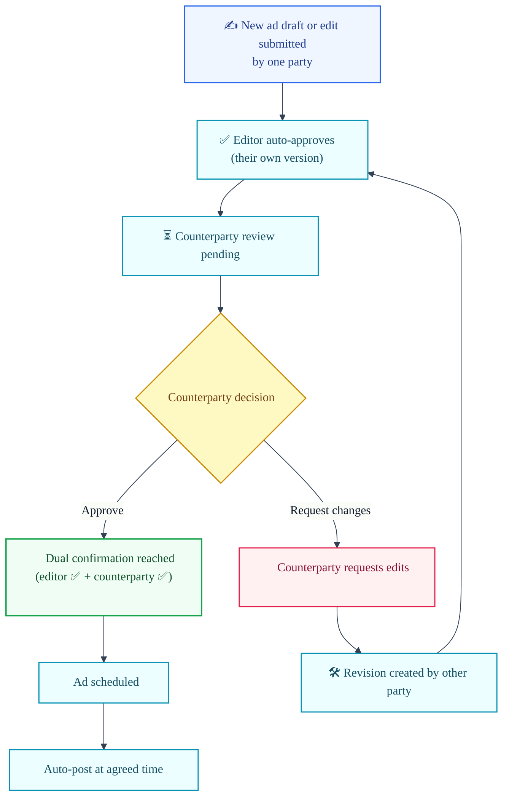

#  DRAFTS
## Creative Approval Loop (Planned)

```mermaid
%%{init: {"theme":"base","themeVariables":{"fontFamily":"Inter, Segoe UI, sans-serif","primaryColor":"#F8FAFC","primaryTextColor":"#0F172A","primaryBorderColor":"#94A3B8","lineColor":"#334155","tertiaryColor":"#ECFEFF","clusterBkg":"#FFFFFF","clusterBorder":"#CBD5E1"}}}%%
flowchart TD
    A["✍️ New ad draft or edit submitted<br/>by one party"]
    B["✅ Editor auto-approves<br/>(their own version)"]
    C["⏳ Counterparty review pending"]
    D{"🤝 Counterparty decision"}
    E["🔐 Dual confirmation reached<br/>(editor ✅ + counterparty ✅)"]
    F["📅 Ad scheduled"]
    G["🚀 Auto-post at agreed time"]
    H["💬 Counterparty requests edits"]
    I["🛠️ Revision created by other party"]

    A --> B --> C --> D
    D -->|Approve| E --> F --> G
    D -->|Request changes| H --> I --> B

    classDef start fill:#EFF6FF,stroke:#2563EB,color:#1E3A8A,stroke-width:1.5px;
    classDef action fill:#ECFEFF,stroke:#0891B2,color:#164E63,stroke-width:1.5px;
    classDef decision fill:#FEF9C3,stroke:#CA8A04,color:#713F12,stroke-width:1.5px;
    classDef success fill:#F0FDF4,stroke:#16A34A,color:#14532D,stroke-width:1.8px;
    classDef feedback fill:#FFF1F2,stroke:#E11D48,color:#881337,stroke-width:1.5px;

    class A start;
    class B,C,F,G,I action;
    class D decision;
    class E success;
    class H feedback;
```